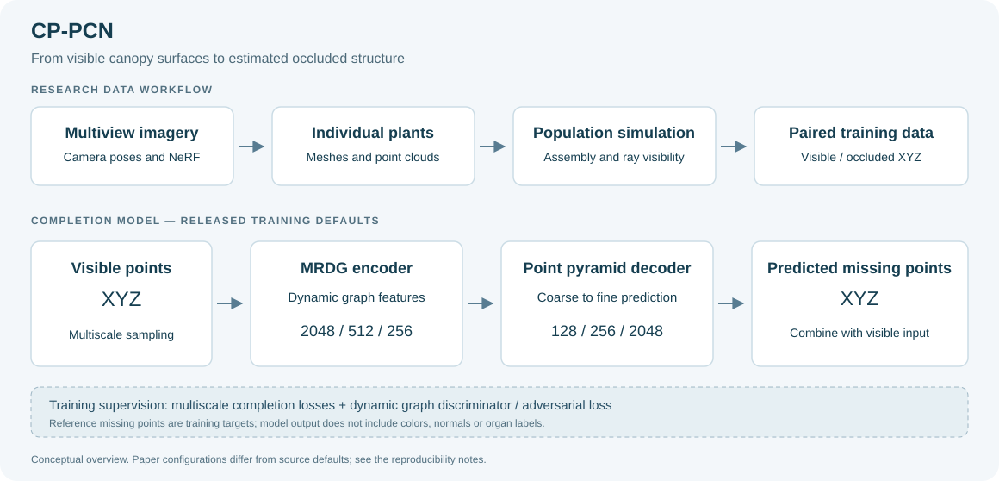

# CP-PCN: Crop Population Point Cloud Completion Network

**Completing occluded crop canopy structure from 3D point clouds.**

[English](README.md) | [简体中文](README.zh-CN.md) · [Paper](https://doi.org/10.1016/j.xplc.2025.101675) · [Data guide](docs/DATA.md) · [Usage](docs/USAGE.md)

Research code for **“A novel point cloud completion model for three-dimensional reconstruction of complex, dynamic population-level crop canopy architecture”**, Guo et al., *Plant Communications* **7**(3), 101675 (**2026**).

CP-PCN predicts occluded canopy points from visible surface point clouds. The research workflow combines reconstructed individual plants, simulated populations and visibility-based training pairs with a multi-resolution dynamic graph encoder and point pyramid decoder. The encoder extracts dynamic graph features at each scale; the discriminator also uses dynamic graph operations during adversarial training.



## What is available

| Component | Status |
| --- | --- |
| Model, training, inference and historical analysis scripts | Included |
| Example point-cloud data | 80 paired XYZ `.pts` files per input/target directory, plus CSV/TXT examples |
| Training/validation/test lists | Included; **all 16 validation IDs also occur in the 72-entry training list** |
| Pretrained weights | Not included in the current Git tree or GitHub releases |
| Complete study dataset / environment lock | Not provided in this repository |
| Dataset checker and automated checks | Added in October 2026; independent of PyTorch |

The October 2026 maintenance preserves the original model code, sample clouds, split lists and MIT license. It corrects documentation, adds citations and provides a read-only data checker. **It does not claim an out-of-the-box training run or reproduction of the paper.**

Legacy filenames use `RP_PCN` / `RPPCN`; these are retained for compatibility. **CP-PCN** is the published model name.

## Paper-reported performance

The model-comparison section of the [paper](https://doi.org/10.1016/j.xplc.2025.101675) reports:

| Rapeseed stage | Chamfer distance, as reported |
| --- | ---: |
| Seedling | 3.35 cm |
| Bolting | 3.46 cm |
| Flowering | 4.32 cm |
| Pod | 4.51 cm |

These are published values, not newly measured results. The repository's loss functions use squared distances and scaling; see [metric caveats](docs/REPRODUCIBILITY.md) before comparing their raw outputs with the table.

The rice experiment **retrained the model from scratch on rice data**. It supports applying the workflow to another crop, not zero-shot transfer of rapeseed weights.

## Quick start: inspect data without a GPU

The new checker needs only **Python 3.11+ and its standard library**:

```bash
git clone https://github.com/Ziyue-Guo/CP-PCN.git
cd CP-PCN
python tools/check_dataset.py --cloud dataset/mydata/02691156/points/moved_IMG_4580_frames_down.pts
```

Audit the paired dataset and all split lists:

```bash
python tools/check_dataset.py --root dataset/mydata
```

**Expected result for the bundled data:** the full audit returns a nonzero status because the train/validation lists share 16 IDs. The example data is preserved as supplied; a successful single-cloud format check does not establish an independent evaluation split.

The checker does not downsample, normalize or overwrite point clouds. See [DATA.md](docs/DATA.md) for schemas, limitations and preparing your own data.

## Train, predict and evaluate

Read [USAGE.md](docs/USAGE.md) before running the legacy scripts. They need external dependencies, path corrections, a CUDA-capable configuration and, for prediction, compatible model weights.

| Task | Actual entry point |
| --- | --- |
| Train CP-PCN | `Train_RP_PCN.py` |
| Predict from a CSV example | `Test_csv.py` |
| Historical distance analysis | `show_CD.py` |
| Historical completion export | `show_recon_RPPCN.py` |
| Generate population/visibility data | `create_dataset.py` |
| Run the historical COLMAP batch workflow | `COLMAP_batch.py` |

The analysis/export scripts require adaptation to the current loader and point counts. There is no `evaluate.py` or `visualize_results.py`. The former README's `Train_RPPCN.py` spelling and `requirements.txt` installation command did not point to existing files.

## Repository map

```text
CP-PCN/
├── Model_RP_PCN.py           # Generator and discriminator definitions
├── Train_RP_PCN.py           # Historical training entry point
├── RP_PCN_loader.py          # Paired point-cloud loader
├── Test_csv.py              # Historical single-example prediction
├── create_dataset.py        # Population assembly and visibility classification
├── COLMAP_batch.py          # Machine-specific reconstruction batch helper
├── show_CD.py               # Historical distance analysis
├── show_recon_RPPCN.py      # Historical point-cloud export
├── dataset/mydata/          # Example pairs, category mapping and split lists
├── test_one/               # Existing CSV/TXT examples
├── Checkpoint/             # Historical logs; not trained model weights
├── Trained_Model/          # Placeholder, not a pretrained checkpoint
├── self-test/              # Historical ablation scripts, not automated tests
├── tools/check_dataset.py  # Read-only dataset audit
├── tests/                  # New automated checker tests
├── docs/                   # Data, usage and reproducibility notes
├── CITATION.cff
└── references.bib
```

## Citation

> Guo, Z., Yang, X., Shen, Y., Zhu, Y., Jiang, L., & Cen, H. (2026). A novel point cloud completion model for three-dimensional reconstruction of complex, dynamic population-level crop canopy architecture. *Plant Communications*, 7(3), 101675. https://doi.org/10.1016/j.xplc.2025.101675

Use [references.bib](references.bib) or GitHub's **Cite this repository** action. The DOI contains `2025`, but the final volume/issue citation is **2026**; the old in-press citation is superseded.

## Acknowledgments, license and contributions

This work builds on [PF-Net (CVPR 2020)](https://github.com/zztianzz/PF-Net-Point-Fractal-Network). Retain appropriate upstream attribution when reusing its components. This repository retains its existing [MIT license](LICENSE).

For bugs or resources, open a [GitHub issue](https://github.com/Ziyue-Guo/CP-PCN/issues) or contact the maintainer listed in the paper/repository. Include your command, environment and traceback; see [CONTRIBUTING.md](CONTRIBUTING.md).
